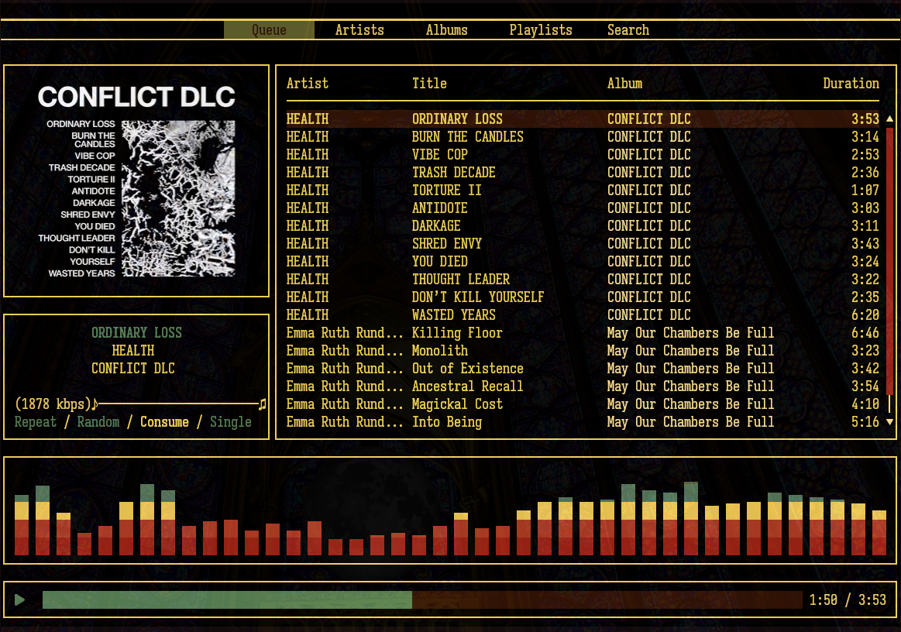

# Music Player Daemon and RMPC Config
This is built to match the appearance of my [config for kitty terminal and neovim](https://github.com/maxturer/kitty-nvim-conf)

TODO: move adaptable colors version to this repo (this version is hard coded to mona lisa theme, but i have another matched to terminal 16-color variables)
