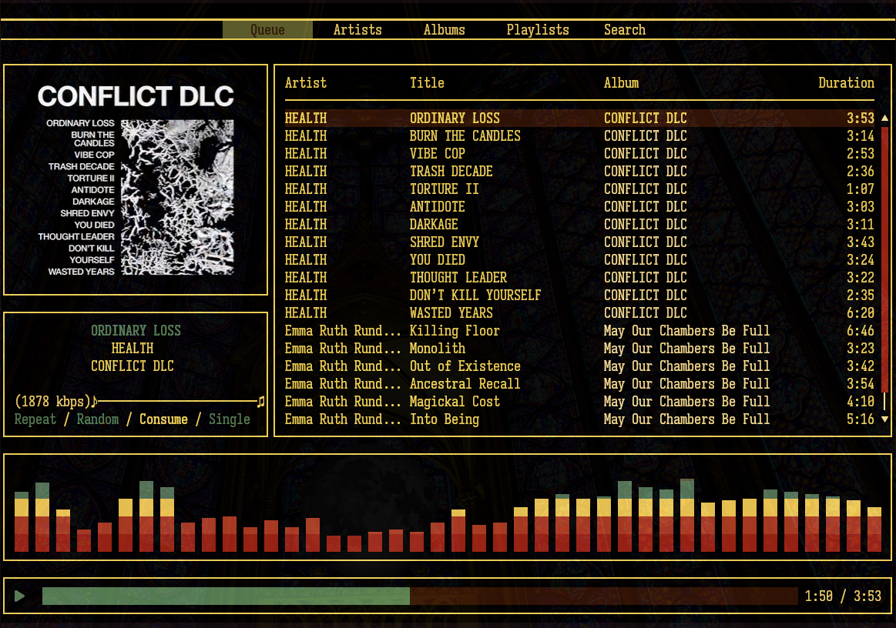
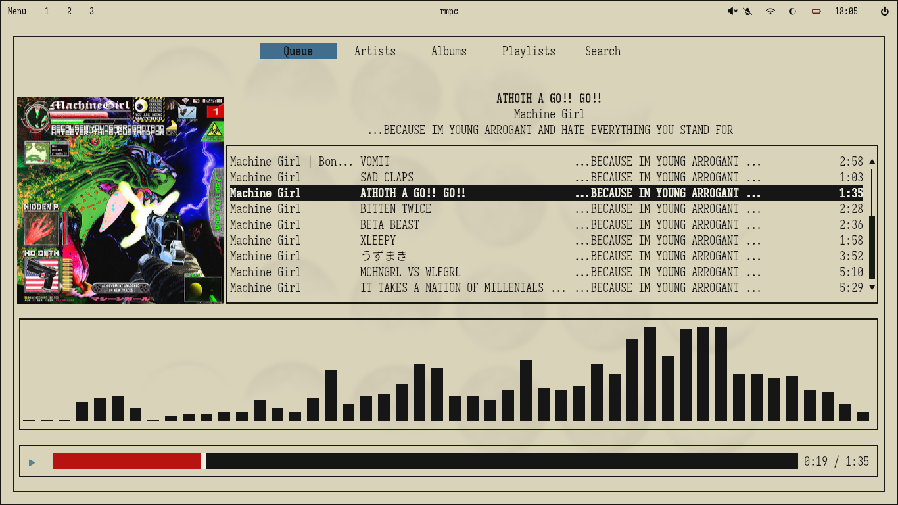

# Music Player Daemon and RMPC Config
This is built to match the appearance of my [config for kitty terminal and neovim](https://github.com/maxturer/kitty-nvim-conf)




comes with two themes! "tama" is hard-coded to the modified mona lisa kitty theme included in these docs. "nier" is terminal-neutral and more responsive to vertical windows (i use it on my hyprland setup, so it tiles well. it's called that because my whole setup is the color of the nier automata UI, don't worry about it)

## Dependencies?

Arch:
```
sudo pacman -S mpd cava rmpc
```

Ubuntu and similar:
```
sudo apt install mpd cava rmpc
```

Mac (homebrew):
```
brew install mpd cava rmpc
```

## Where does the config go

good question

most of these directories and files don't exist automatically! maybe none of them!
use `mkdir` followed by a space and then the file paths below. for example, i just set this up on a mac and had to create everything: `mkdir ~/.mpd`, `cd ~/.mpd`, `touch mpd.db mpd.log mpd.pid mpdstate` (that one creates the blank files mpd needs), `mkdir ~/.config/rmpc`

you can use that setup on linux, but replace every instance of `~/.mpd` with `~/.config/mpd`

now you can move the proper config files from here

`config.ron`, `nier.ron`, and `tama.ron` should go in `~/.config/rmpc` (if you don't want the colorful "tama" theme, you can skip that .ron file)

`mpd.conf` goes in `~/.config/mpd` on linux and `~/.mpd` on mac

MAC NOTE: The `mpd.conf` file is set up for pipewire. This should be what you want for most linux distros, but on macOS the first `audio_output` should be replaced with:
```
audio_output {
    type                  "osx"
    name                  "CoreAudio"
    mixer_type            "software"
}
```

(if that trips you up, you can refer to [this config file](https://gist.github.com/sdushantha/fd0b4f7d69b814317bc33da3a57fdf49), which I did at first)

## Ok how do i use it 

run mpd with `sudo systemctl start mpd` (linux) or `brew services start mpd` (mac)

run rmpc with `rmpc`
